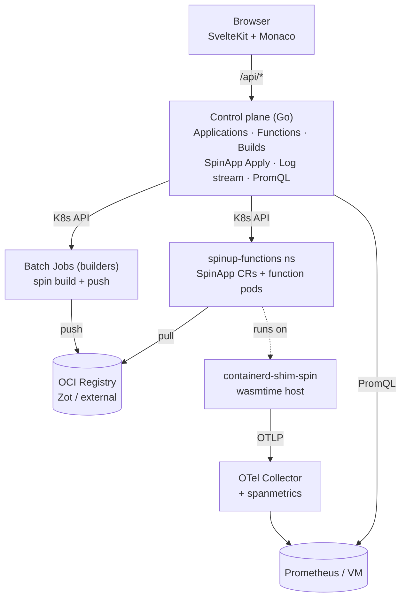

# SpinUP

Cloud-functions-style platform for [Spin](https://spinframework.dev) HTTP components on Kubernetes. Write source in the browser, hit Build & Deploy, get an HTTP endpoint backed by a `SpinApp` on [SpinKube](https://www.spinkube.dev) — or an entry in a shared wasmtime worker pool. Multi-language, multi-tenant-ready, OIDC-only auth.

**Full documentation**: run `pnpm --filter spinup-docs dev` and open the site, or read the Markdown in [`docs/`](./docs).

## Status

Alpha. Everything below the "what works today" line is validated end-to-end; workerpool runtime is blocked upstream on a WASI HTTP RC version mismatch (see [scaling roadmap](./docs/scaling-roadmap.md)).

**What works today**:

- Create Applications with N Functions, each with its own HTTP route
- Edit source in Monaco (Go / JS / TS / Rust templates included)
- Build → OCI push → SpinApp CR apply → pod serves requests
- Invoke functions from the UI or via the CP's `/invoke` endpoint (K8s service-proxy relay)
- Stream pod stderr live into the UI
- Per-Application CPU + memory panel (from cAdvisor + kube-state-metrics)
- Per-Function request rate + p95 latency + 5xx rate panel (from OTel spanmetrics via the bundled OTel Collector)
- Helm chart deploys the whole stack: control plane, SpinAppExecutor, optional Zot registry, optional worker, optional OTel Collector

## Architecture



See [docs/architecture/overview.md](./docs/architecture/overview.md) for the full explanation.

## Design decisions

- **Auth**: OIDC-only, no local users. `SPINUP_DEV_INSECURE_SKIP_AUTH=true` for local dev.
- **State**: SQLite (single-node/dev) or Postgres (HA), chosen at install time.
- **Ingress**: Istio Gateway + VirtualService by default; disable for your own Ingress/Gateway API.
- **Build**: server-side, in-cluster Kubernetes Jobs run per-language builder images.
- **V1 languages**: Go, JavaScript, TypeScript, Rust. V1 triggers: HTTP.
- **Tenancy**: single-tenant today, schema carries `tenant_id` for later.
- **Observability**: OpenTelemetry throughout. Bundled OTel Collector with a spanmetrics connector; bring your own Prometheus-compatible TSDB and point the CP at it.
- **Runtimes**: `spinkube` (default) and `workerpool` (alpha, blocked upstream). See [docs/architecture/runtimes.md](./docs/architecture/runtimes.md).

## Repo layout

```
apps/ui/                 # SvelteKit + Svelte 5 + Vite 8 + Monaco (pnpm workspace)
builders/{go,js,ts,rust}/# Per-language builder Docker images
deploy/helm/spinup/      # Helm chart (control plane + executor + Zot + worker + OTel)
docs/                    # VitePress documentation site
services/
  control-plane/         # Go HTTP API — the brains
  worker/                # Rust wasmtime host (workerpool runtime)
```

## Quick start (local dev)

Full setup with troubleshooting: [docs/install/local-dev.md](./docs/install/local-dev.md).

Rough path:

1. Install [Rancher Desktop](https://rancherdesktop.io) with **containerd + Kubernetes + Wasm mode**.
2. Install cert-manager + spin-operator (see [docs/install/local-dev.md](./docs/install/local-dev.md#2-install-spinkube)).
3. Deploy an in-cluster OCI registry and configure containerd's mirror ([docs](./docs/install/local-dev.md#containerd-mirror)).
4. Build the language builder(s) into Rancher's containerd:
   ```bash
   nerdctl --namespace k8s.io build -f builders/go/Dockerfile -t spinup/builder-go:latest builders/go
   ```
5. Run the control plane:
   ```bash
   cd services/control-plane
   SPINUP_DEV_INSECURE_SKIP_AUTH=true \
   SPINUP_FUNCTIONS_NAMESPACE=spinup-functions \
   SPINUP_DB_DSN=/tmp/spinup.db \
   SPINUP_OCI_REGISTRY_URL=registry.spinup-functions.svc.cluster.local:5000/spinup \
   go run ./cmd/control-plane
   ```
6. Run the UI:
   ```bash
   pnpm install
   pnpm --filter ui dev
   ```
7. Open <http://localhost:5173>, create an Application, edit `main.go`, click Build & Deploy.

## Requirements

- Kubernetes 1.27+ with a containerd that supports the [containerd-shim-spin](https://github.com/spinframework/containerd-shim-spin) shim
- cert-manager + spin-operator
- An OCI registry (Zot bundled with the chart, or bring your own)
- An OIDC provider (or `SPINUP_DEV_INSECURE_SKIP_AUTH=true` for local dev)
- Go 1.22+ (for the control plane), Rust 1.83+ (for the workerpool worker), pnpm 10+ / Node 20+ (for the UI + docs)

Full list: [docs/install/requirements.md](./docs/install/requirements.md).

## Docs

The `docs/` directory is a VitePress site.

```bash
pnpm --filter spinup-docs dev     # local preview
pnpm --filter spinup-docs build   # static output → docs/.vitepress/dist
```

Sections:

- **Guide** — introduction, quick start, core concepts
- **Install** — requirements, local dev on Rancher/k3s, Helm install
- **User Guide** — creating apps, writing functions, building, invoking, logs & metrics
- **Architecture** — overview, control plane, builders, runtimes, observability, scaling roadmap
- **Reference** — HTTP API, control-plane env vars, chart values, DB schema

## Contributing

Alpha software. If you want to hack on it:

- Control plane: standard Go module, `go test ./...` in `services/control-plane`.
- UI: `pnpm --filter ui check` for type check + Svelte check.
- Worker: `cargo test` in `services/worker` (build is heavy the first time).
- Docs: `pnpm --filter spinup-docs build` catches broken links.

Open issues welcome. The scaling roadmap (`docs/scaling-roadmap.md`) has a long tail of things we're not going to do soon; feel free to pick one up.

## License

Source available under the [PolyForm Noncommercial 1.0.0](./LICENSE) license.

Non-commercial use — personal projects, research, evaluation, internal non-production tools — is free.

Commercial use (running SpinUP to serve production workloads, offering it as a hosted service, bundling it into a commercial product) requires a separate agreement. See [LICENSE-COMMERCIAL.md](./LICENSE-COMMERCIAL.md) or contact michal@jaskolski.pro.

Contributions are welcome under the [Contributor License Agreement](./CLA.md).

Third-party dependency licenses: see `THIRD-PARTY-NOTICES.md` under each service. Regenerate with `bash scripts/gen-third-party-notices.sh` after touching dependencies.
