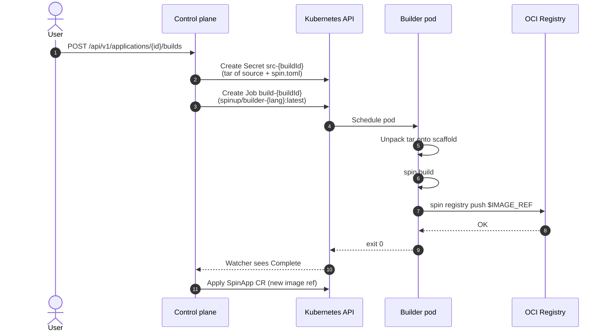

# Builders

Location: `builders/{go,js,ts,rust}`. One Docker image per supported language.

## Job model

Builders are **not** long-running services. Every build is a **one-shot Kubernetes Batch Job** created and reaped by the control plane. When idle, zero builder pods run.



## Image layout

Each language's Dockerfile follows the same rough shape:

```dockerfile
FROM golang:1.26-bookworm       # or node:24, rust:1.97
ARG SPIN_VERSION=v4.0.2

RUN apt-get install …
RUN curl … spin … | tar -xz    # download Spin CLI
RUN spin templates install …   # warm the template cache
RUN spin new -t http-{lang} scaffold   # generate the scaffold at build time
RUN cd scaffold && <language-specific dep warm-up>

COPY entrypoint.sh /usr/local/bin/spinup-build
ENTRYPOINT ["/usr/local/bin/spinup-build"]
```

**Why bake the scaffold in?** Two reasons:
1. **Speed** — every build reuses the same `go mod download` / `npm install` / cargo registry hydration that was done once at image-build time.
2. **Determinism** — the scaffold's structure doesn't change between builds, so user tars overlay on a known shape.

## Entrypoint contract

Every builder's `entrypoint.sh` follows the same contract:

- **Input via env**:
  - `IMAGE_REF` — the OCI tag to push (`{registryUrl}/{appName}:{buildId}`)
  - Optional Docker credentials at `/root/.docker/config.json` (mounted from a Secret when the control plane runs with `SPINUP_OCI_AUTH_SECRET`)
- **Input via mount**:
  - `/source/source.tar.gz` — the tar containing `spin.toml` + per-function subdirs
- **Behaviour**:
  1. Extract `/source/source.tar.gz` on top of the pre-baked scaffold
  2. Run `spin build`
  3. Run `spin registry push $IMAGE_REF --insecure`
  4. Exit 0 on success, non-zero on failure
- **Output**:
  - Stdout/stderr → captured by kubelet → tailed by the control-plane watcher
  - No side channel (everything goes through the OCI push)

## Per-language notes

### Go

- Base: `golang:1.26-bookworm`
- Toolchain: standard Go 1.26 + [`componentize-go`](https://github.com/bytecodealliance/componentize-go) v0.3.3 (declared as a Go tool via `go.mod`'s `tool` directive)
- Spin scaffold uses `http-go` template
- Build command (in synthesized `spin.toml`): `go tool componentize-go build`
- Note: `ENV OTEL_SDK_DISABLED=true` — works around a Spin v4.0.2 CLI bug where `spin --version` and other invocations panic trying to initialize OTel tracing when no exporter is configured.

### JavaScript / TypeScript

- Base: `node:24-bookworm`
- Toolchain: Node 24 + the `js2wasm` Spin plugin + `spin new -t http-{js|ts}` scaffold
- Build command: `["npm install", "npm run build"]` (array — Spin's build syntax for multi-step commands)
- Output: `dist/scaffold.wasm`
- TypeScript adds `typescript` + tsconfig to the base template; compiles to JS before `js2wasm` runs

### Rust

- Base: `rust:1.97-bookworm`
- Toolchain: Rust 1.97 with `wasm32-wasip2` (and `wasm32-wasip1` for legacy templates)
- Build command: `cargo build --target wasm32-wasip2 --release`
- Output: `target/wasm32-wasip2/release/scaffold.wasm`
- Scaffold ships a pre-hydrated Cargo registry index for faster first builds

## Adding a new language

Roughly:

1. Create `builders/{lang}/Dockerfile` following the pattern above
2. Create `builders/{lang}/entrypoint.sh` (usually a direct copy — the contract is language-agnostic)
3. Add a case to `internal/builder/manifest.go` → `writeComponent(...)` for the new language's `spin.toml` block
4. Add the language to the CP config's builder-image env var list
5. Add a template to `apps/ui/src/lib/templates.ts`

## Registry push semantics

`spin registry push $IMAGE_REF --insecure` uploads a single OCI artifact containing:

- The `spin.toml` manifest
- One WASM blob per component (`spin build` outputs one `.wasm` per component in-place)

The `--insecure` flag makes Spin push over plain HTTP without TLS. Needed for the in-cluster `registry:2` and for Zot when it's serving plain HTTP. For registries that require auth, mount the credentials as `/root/.docker/config.json` (via `SPINUP_OCI_AUTH_SECRET` on the control plane).

## Failure modes

| Failure | Symptom | Root cause |
|---|---|---|
| Compile error in user code | `Job has reached the specified backoff limit`, log shows Go/JS/TS/Rust compiler error | User code — fix and rebuild |
| Missing runtime component | `no such tool "componentize-go"` | Builder image is stale; rebuild |
| Push denied | `401` or `pull access denied` | Registry credentials wrong or missing |
| Push connect refused | `dial tcp: connection refused` | Registry Service isn't up, or Job pod can't resolve DNS |
| Node can't pull the pushed image | pod events show `no such host` | containerd mirror config missing on the k3s node (see [Local dev](/install/local-dev#containerd-mirror)) |

## Building the builder images

The images have to exist in your cluster's container runtime before the first build.

**Rancher Desktop / k3s / containerd**:

```bash
nerdctl --namespace k8s.io build -f builders/go/Dockerfile -t spinup/builder-go:latest builders/go
# … repeat for js, ts, rust
```

**Docker Desktop / kind**:

```bash
docker build -t spinup/builder-go:latest builders/go
kind load docker-image spinup/builder-go:latest --name spinup
```

**Production**: build and push to your registry, then point `SPINUP_BUILDER_IMAGE_GO` (etc.) at the pushed tags via Helm values.

## Rust build times

The Rust builder is slow to build the first time (~10-15 min in a Lima VM with 4 CPUs) because it warms the Cargo registry index and pre-fetches the wasm32-wasip2 target's std libraries. Subsequent rebuilds are much faster thanks to Docker layer caching.

If you're iterating on the Rust Dockerfile itself, split heavy layers (rustup target install, spin templates install) from the entrypoint COPY so you don't re-run them on every iteration.
