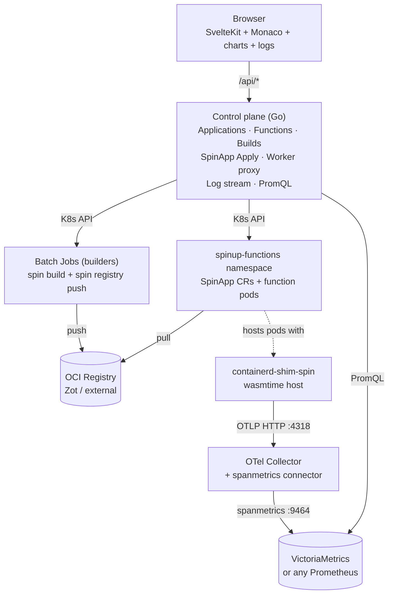

# Architecture overview

SpinUP is a small set of services stitched together to give you a Kubernetes-native cloud-functions workflow for [Spin](https://spinframework.dev) apps.

## System diagram

## The pieces

### Control plane (Go)

Located at `services/control-plane`. HTTP API server with SQLite/Postgres backing. Responsibilities:

- **CRUD** for Applications, Functions, Sources, Builds via `/api/v1/*`
- **Build orchestration**: synthesizes `spin.toml`, packs source into a Secret, creates a Batch Job, watches it, updates the build row
- **Deploy**: applies `SpinApp` CRs via server-side apply for `runtime: spinkube`
- **Invoke proxy**: relays UI-initiated requests to the pod via the K8s API server’s service proxy
- **Log streaming**: chunked HTTP endpoint that streams `kubectl logs -f` output from the underlying pod
- **PromQL queries**: derives the per-Application and per-Function metrics served to the UI

Fully documented at [Control plane](/architecture/control-plane).

### Builders (Docker images)

Located at `builders/{go,js,ts,rust}`. Each is a pre-baked container image with:

- The Spin CLI (currently v4.0.2)
- The language-specific toolchain (Go 1.26 / Node 24 / Rust 1.97)
- A warm scaffold generated by `spin new -t http-{lang}`
- An `entrypoint.sh` that unpacks user source, runs `spin build`, and runs `spin registry push`

The control plane launches these as K8s Batch Jobs on every build.

Fully documented at [Builders](/architecture/builders).

### How Applications run

Control plane writes a `SpinApp` CR → spin-operator translates to Deployment + Service → pods use `containerd-shim-spin` → wasmtime executes the component. One pod per Application.

Densification and scale-to-zero patterns are on the [scaling roadmap](/architecture/scaling-roadmap).

### Observability

Traces flow from `containerd-shim-spin` (OTLP/HTTP) to the bundled OTel Collector. A **spanmetrics connector** turns HTTP request spans into per-`http.route` RED metrics on the collector's `:9464/metrics`. A Prometheus-compatible TSDB (VictoriaMetrics, Prometheus, Mimir) scrapes that endpoint and gets queried by the control plane on behalf of the UI.

Fully documented at [Observability](/architecture/observability).

### UI (SvelteKit)

Located at `apps/ui`. Svelte 5 + Vite 8 + Monaco. Talks only to the control plane over `/api/*` (proxied by Vite in dev, or the ingress in production). No client-side access to Kubernetes or PromQL — everything is mediated by the control plane.

## Deployment topology

The chart supports two shapes:

**Development** (what the docs assume you're running locally):

- Control plane runs as a **local Go process** on your laptop (`go run ./cmd/control-plane`)
- UI runs as **Vite dev server** (`pnpm --filter ui dev`)
- Everything else lives in the k3s cluster (Rancher Desktop)
- Metrics stack (VM, OTel, kube-state-metrics) accessed via `kubectl port-forward`

**Production** (via `helm install`):

- Control plane as a **K8s Deployment** in the `spinup` namespace
- UI **served by the control plane** as static assets (or via a separate Deployment — future)
- Ingress via Istio Gateway + VirtualService (or your own Ingress controller)
- OCI registry (Zot) in-cluster or external
- Function pods land in `spinup-functions` — a separate namespace for RBAC + NetworkPolicy isolation

## Data flow: creating and running a function

Following one Application from creation to invocation:

1. **User** creates an Application in the UI → CP writes `applications` row + first `functions` row.
2. **User** edits `main.go` in Monaco → CP writes to `sources` (JSON blob).
3. **User** clicks Build & Deploy → CP:
   - Synthesizes `spin.toml` in memory
   - Packs `spin.toml` + `functions/greeter/main.go` into a tar → K8s Secret
   - Creates a Job (image: `spinup/builder-go:latest`, env: `IMAGE_REF=…`)
4. **Job pod** starts → runs `spin build` (compiles WASM) → runs `spin registry push` (pushes OCI to Zot).
5. **CP watcher** sees Job success → calls `spinapp.Apply(...)`.
6. **spin-operator** sees the new SpinApp → creates/updates a Deployment.
7. **Kubelet** pulls the OCI image via containerd (mirror config resolves cluster-DNS name).
8. **Pod** starts under `runtimeClassName: wasmtime-spin-v2` → `containerd-shim-spin` boots a wasmtime process → the SpinApp Deployment's Service becomes Ready.
9. **User** clicks Try it out → UI sends `POST /api/v1/…/invoke` → CP relays through the K8s API server's service proxy → pod's HTTP handler responds → CP returns the response envelope to the UI.
10. **Meanwhile** the shim emits an OTLP span to the collector → spanmetrics connector increments `traces_span_metrics_calls_total{http_route="/..."}` → VictoriaMetrics scrapes it → the UI's Traffic panel plots it (via the CP's PromQL endpoint).

## Design principles

- **Kubernetes-native over ad-hoc daemons.** Every state change is a K8s object (SpinApp, Job, Secret) so `kubectl` can inspect everything.
- **Server-side templating.** The client never generates `spin.toml`. All manifests come from `services/control-plane/internal/builder/manifest.go`, so upgrading the manifest schema is a one-file change.
- **Immutable builds.** Each build tag is a UUID. Never overwrite a tag; roll forward or roll back by pointing at a different one.
- **UI has no direct cluster access.** Every query the UI makes is via the CP HTTP API — one place to enforce auth, quotas, and rate limits.
- **SSO (OIDC) ready.** No local users. Bring any OIDC provider.
